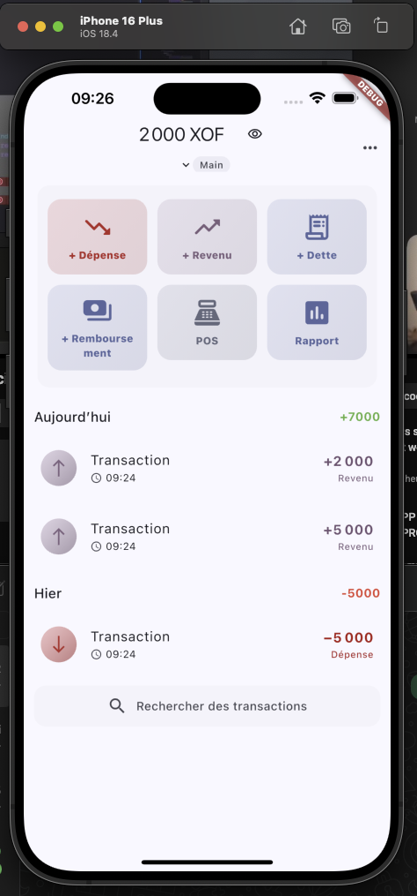
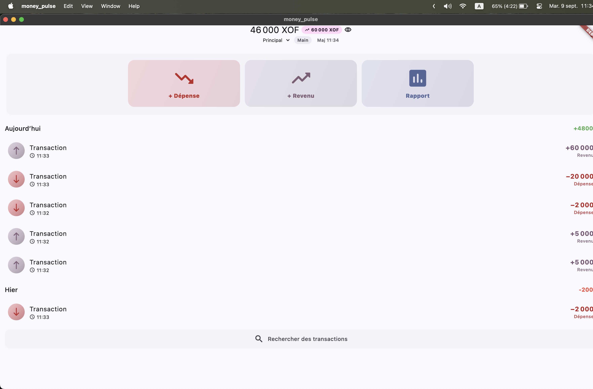

# Top all money (Flutter)

Stack: **Flutter • SQLite • DDD • Deferred Sync**

---

## Overview

**Top all money** is a financial management app for **mobile and desktop**.  
It is designed with an **offline-first** approach, featuring **selective and deferred synchronization** powered by **Domain-Driven Design (DDD)**.

The app focuses on:
- **Local performance** powered by SQLite
- **Smooth user experience** with a clean UI
- **Reliability** through an outbox-based sync strategy

---

## Features

- Manage accounts, categories, and transactions
- Track balances, income, and expenses
- Full **offline mode** with deferred synchronization
- Modular **DDD architecture** for scalability
- Cross-platform support: **iOS, Android, and Desktop**

---

## Getting Started

### Run in development mode

```bash
flutter run
```

MOBILE



DESKTOP

